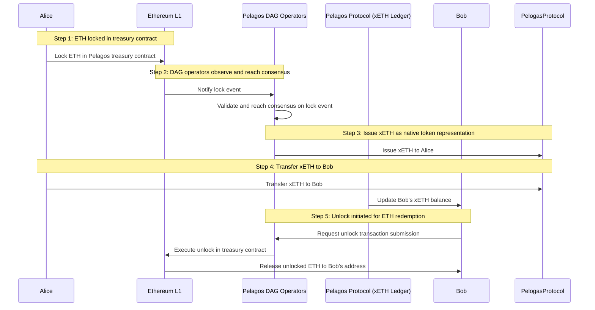
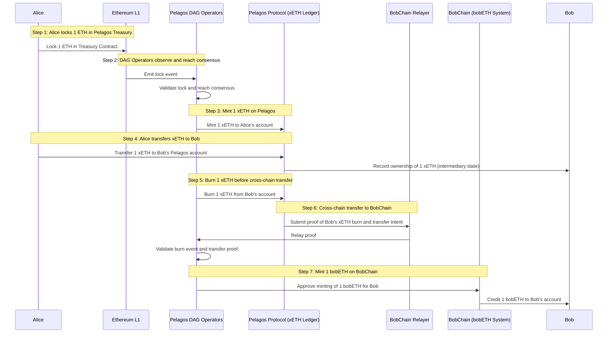

Pelagos technology

> Content NOT ready for review pass. 

Terminology:
Refer to it as the Pelagos DAG consensus network, or simply Pelagos consensus layer.
Reserve “Appchain” for the individual chains or runtimes that run user applications and smart contracts, which operate on top of or alongside the DAG consensus network.

Pelagos presents a purpose-designed Directed Acyclic Graph (DAG) consensus network. DAG operators compose a distributed set of validators who witness events and transactions on external blockchains, reach consensus among themselves regarding these observations, coordinate state changes within the Pelagos network, and, finally, instantiate the state change on the underlying blockchain.

To achieve this, Pelagos integrates Erigon's highly efficient database structure and modular client design bringing Appchains:

- Compact state management
- High throughput
- Optimized resource consumption model

[Erigon's](https://erigon.tech/benefits-of-caplin-erigons-internal-cl-and-erigon-el-for-staking/) immutable database model provides a multichain, universal state, ensuring efficient state synchronization. This enables Appchains to handle rapidly growing states across a multichain landscape without performance degradation.

## Directed Acyclic Graph for scale and speed

Blockchains typically organize data as a linear chain of blocks, where each block contains multiple transactions and links cryptographically to the previous block, forming a single, sequential, immutable history. DAGs (Directed Acyclic Graphs), by contrast, use a graph structure, allowing transactions to be processed independently and in parallel rather than sequentially. DAGs do not batch transactions into blocks but treat individual transactions as first-class entities that reference multiple prior transactions.

The Pelagos consensus layer allows dApp builders to rely on the strong finality and fundamental security of the asset-managing blockchain that users' funds are native to, while enjoying the scalability and speed offered by the DAG consensus mechanisms.

{?is consensus achieved via a gossip-like communication?}

## Atomic cross-chain asset portability without bridging or wrapping

{?is Pelagos acting like a multichain AMM with liquidity providers on the abstraction layer}
> ? Like an AMM, Pelagos aggregates liquidity into common pools that traders can access directly.
> ? Instead of matching individual buy/sell orders, trades are executed against pooled assets across chains.
> ? This shared liquidity layer mitigates fragmentation by unifying capital from different blockchains.
> ? Liquidity providers enable access to this pooled liquidity by depositing assets into the abstraction layer’s vaults.
> ? Pricing and routing happen by interpreting user intents and optimizing execution paths through these unified pools.
> ? So while Pelagos operates as a cross-chain unified liquidity fabric rather than a classic AMM on a single chain, does it still fundamentally depend on liquidity providers on its abstraction layer to provide and coordinate access to what would otherwise be fragmented liquidity at the base blockchain layers. OR does the process apply equally regardless of whether the deposit comes from an individual user or from pooled funds (lps).

Pelagos eliminates bridges and wrapped tokens with its native cross-chain asset representation. When dApp users trigger a transfer or swaps token, the Pelagos protocol locks the asset/s in the treasury contract on the origin blockchain and issues corresponding native token representation/s on the Pelagos Appchain. This issuance is essentially an accounting record representing a claim on the locked token on the origin chain.

Unlike bridges that lock assets on one chain and mint wrapped tokens on another &mdash; often relying on multi-signature wallets or centralized validators, Pelagos replaces these models with its DAG-based consensus network. This network consists of a distributed, decentralized set of operators, “DAG operators” who collectively observe and validate events such as asset locks or state changes on origin chains, then attest to those events within Pelagos’ own consensus process.

The consensus process is similar, in principle, to that achieved by a blockchain’s validator set. Upon consensus, the network issues a native token representation that is directly backed by locked real assets, enabling seamless, atomic, cross-Appchain mobility without re-wrapping or traditional bridging.

By substituting trusted third-party custodian or bridge operators with a decentralized collective validator set and a robust consensus protocol, Pelagos narrows trust assumptions to the distributed operator set, greatly reducing single points of failure and enhancing security.

This also ensures strong correctness guarantees: only consensus-approved events produce token issuance or state change, preserving atomicity and preventing double-spends or fraudulent minting.

In short, Pelagos’ DAG operator consensus network embodies the same trust model principles as a decentralized blockchain, replacing custodial bridges with decentralized observation, agreement, and native token issuance. This is a key innovation addressing many of the security and composability issues caused by traditional wrapped tokens and bridge constructions.

## Lifecycle of a transaction 

## Transfer on a single network

Let's consider the lifecycle of a transaction as Alice transfers ETH to Bob on Ethereum Layer 1.

Step 1: ETH loced in the Pelagos treasury contract on Ethereum L1

1.1 Alice initiates a transaction via a dApp on Pelagos.

1.2 Alice's ETH is locked in the Pelagos treasury contract deployed on Ethereum mainnet (Ethereum L1).

> This treasury contract acts as an onchain custodian ensuring that the locked ETH remains securely held and cannot be spent elsewhere during the transfer process.

> The lock event is transparently recorded on Ethereum, serving as a verifiable proof of asset custody.

Step 2: Observation and consensus by DAG Operators

Pelagos operates a decentralized network of DAG operators who continuously monitor external blockchains, including Ethereum, for such lock events.

Upon detecting Alice’s ETH lock transaction, the operators collectively validate and reach consensus that this event is legitimate and finalized on Ethereum.

The DAG consensus protocol guarantees correctness and prevents double-spending by ensuring that only genuine and irreversible lock events trigger subsequent actions.

Step 3: Issuance of xETH as native token representation

Once consensus is reached, the Pelagos network issues xETH to Alice’s account within the Pelagos protocol (mapped to her address on the relevant Pelagos Appchain).

xETH is a native representation backed 1:1 by the locked ETH on Ethereum L1. It functions as an accounting record guaranteeing redemption rights proportional to the locked ETH. xETH is fully transferable across the protocol and within Pelagos Appchains.

Step 4: Transfer of the xETH to Bob

Once consensus is reached, the Pelagos network transfers ownership of the xETH to Bob’s account within the Pelagos protocol (mapped to his address on the relevant Pelagos Appchain). This is a native token transfer recorded on Pelagos’ state, securely updating ownership. Bob’s balance increases.

Step 5: Transfer of ETH on Ethereum L1 to Bob

{does Bob have to take any action?? normally the Eth would land whether Bob likes it or not}
{OR}
{Bob has to redeem the locked ETH by triggering an unlock process.}

Pelagos DAG operators coordinate unlocking in the treasury contract, and release the corresponding ETH on Ethereum L1 to Bob’s address. The xETH to ETH redemption is recorded onchain in the treasury contract on Ethereum.

This completes the asset lifecycle from locked ETH → portable xETH → redeemed ETH within the Ethereum network.

## Transfer across networks

Let's consider the lifecycle of a transaction as Alice transfers ETH from Ethereum Layer 1 to Bob on BobChain.

### Step 1: ETH Locked in the Pelagos Treasury Contract on Ethereum L1

1.1 Alice initiates a transaction via a Pelagos-enabled dApp or interface to transfer ETH cross-chain.

1.2 Alice’s ETH is locked securely in the Pelagos treasury smart contract deployed on the Ethereum mainnet (Ethereum L1).

{is Pelagos using 3rd party or doing its own treasury contract and mint/burn?}

The treasury contract acts as an onchain custodian, ensuring locked ETH cannot be spent or transferred elsewhere during the lifecycle.

This lock event is transparently recorded on Ethereum L1 and serves as verifiable proof of custody supporting downstream actions.

## Step 2: Observation and consensus by Pelagos DAG operators

2.1 Pelagos’ decentralized DAG operators observe the lock event.

2.2 Upon detecting Alice’s ETH lock, DAG operators collectively validate and reach consensus that the lock event is valid, finalized, and irreversible on Ethereum.

2.3 This consensus guarantees the validity of the locked asset and prevents any double-spending or fraudulent minting downstream.

### Step 3: Issuance of xETH as Pelagos Native Token Representation (Internal Accounting)

3.1 Once consensus on the lock event is established, the Pelagos protocol issues a corresponding amount of xETH (the Pelagos native representation of Ethereum ETH) to Alice’s account within the Pelagos system (on its Appchain or protocol ledger).

xETH is fully backed 1:1 by the locked ETH on Ethereum L1.

### Step 4: Transfer of xETH Between Alice and Bob on Pelagos Protocol

4.1 Alice transfers her xETH holdings to Bob’s account/address within the Pelagos protocol ledger.

4.2 Pelagos securely updates the ledger to reflect Bob’s ownership of the corresponding xETH tokens.

Step 5: Cross-Chain transfer

bobETH representation of ETH minted on BobChain

5.1 Bob’s ownership of xETH on Pelagos triggers the cross-chain transfer process, where Pelagos DAG operators submit proof of Bob’s xETH token ownership to BobChain relayers or validators.

{3rd parties used for this mint process?? or Pelagos does mint??}

5.2 Upon verifying the proof, Pelagos DAG operators coordinate the minting of bobETH tokens (the BobChain-specific representation of ETH) on BobChain directly credited to Bob’s address.

bobETH on BobChain is fully backed 1:1 by the locked ETH on Ethereum L1 (as per a normal transfer) and the xETH claim controlled by Bob on Pelagos is burned.

## Swap within a network

{repeat swap for cross chain?}

{AI got me this far: Pelagos enables swaps without an order book by using shared, cross-chain liquidity pools where users trade directly against pooled assets instead of matching buy and sell orders. Traders submit high-level intents (e.g., “swap Token A on chain X for Token B on chain Y”), and Pelagos routes execution atomically across chains without wrapped tokens or bridges. This approach reduces complexity, latency, and trust dependencies while maintaining deep liquidity and seamless cross-chain composability through a unified liquidity fabric and platform-agnostic execution layer.}

-------------------------------

This section deep dives how Pelagos handles sequencing, scaling, security, and transaction submission to multichain APIs, and their validators.

{consider breaking down a tx as a high level explainer &mdash; making this up, if retained, needs building out}

1. Submission: The user submits a transaction through the dApp, which is routed to the Pelagos sequencing layer.

2. Sequencing: The sequencer identifies the destination chain, aggregates transactions, orders them, and batches them for validation and execution.

{totally confused by 3 &mdash; is Erigon a da compiler of all the supported L1 and L2 states, or is it a mirror and state change happens there before occuring onchain??}

3. State update and execution: Transactions are executed against the current state on the destination chain in a compact, modular manner using Erigon’s optimized pipelines.

{does Pelagos run its own validators on supported chains? does it use service providers such as Infura?}

4. Consensus and validation: Validators verify transaction correctness and inclusion, ensuring finality and network security.

{Much like for 3, totally confused by 5&mdash; is Erigon a da compiler of all the supported L1 and L2 states, so as finalization occurs on L1/2, the da update reflects and this == finalization from dApp perspective?}

{this framing suggest that there is da layer "multichain universal state"}

5. Finalization and synchronization: State changes are committed to the multichain universal state, and results can be queried via standardized multichain APIs.

Each step of the transaction lifecycle has been optimized.

### Sequencing

### Scaling

### Security

It's vital that Pelagos offers better security guarantees than the existing compromised solutions offered such as those of 3rd-party bridges. To this end, the architectural design leverages immutability and the security-as-a-service model, Autonomous Verifiable Services (AVS).

(note EigenLayer redefined the acronym!)

{making this up needs building out}

Erigon’s immutable database model provides a multichain, universal state. The core universal state cannot be altered retroactively, protecting against rollback and censorship attacks.

Modular execution client: Each component—from transaction pool to execution layer—is strictly sandboxed, minimizing the attack surface.

{from source materials, not made up}

### Security as a service

Pelagos inherits its security model from underlying L1s via restaking services. Restakers reuse staked L1 native tokens such as ETH, BTC, SOL, TON (or liquid staking tokens like stETH) to provide security for additional networks, middleware, and applications beyond L1 itself.

Restaking extends the security guarantees that arise from slashing. L1 stakers, those responsible for compiling the "at risk pot" required to offer validator services, can choose to "restake" their tokens to secure third-party services like rollups, oracles, or data availability layers.

This allows Pelagos to leverage the L1 validator sets for security, mitigating bootstrapping risks.

Pelagos security relies on robust tokens and substantial stakes rather than a single native token &mdash; removing the requirement to trust in a single chain’s token stability. By combining restaking from Ethereum, Bitcoin, Solana, and TON, Pelagos leverages an aggregate security stake far exceeding individual L1s.

### Transaction handling

{multichain APIs, and respective validators)

## Conclusion

Pelagos’ architecture merges Erigon’s proven efficiency with cutting-edge appchain modularity. The results are fast, secure, scalable, and developer-friendly deployments that remove traditional pain points from both single-chain and multichain projects. By offering deterministic sequencing, rapid horizontal scaling, robust validator security, and seamless multichain APIs, Pelagos truly advances the next generation of decentralized application infrastructure.