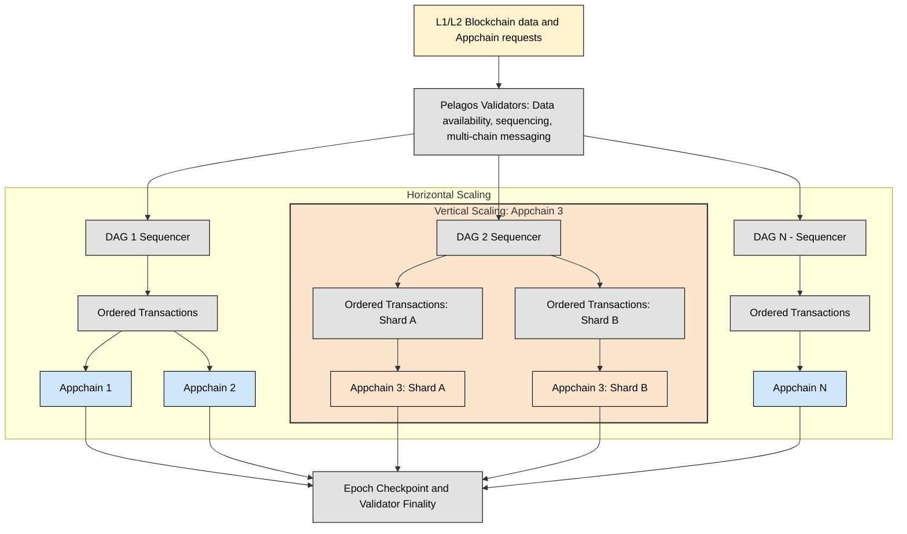

# Design considerations

The Pelagos DAG consensus was purpose‑built to meet a set of strict requirements for scalability, latency, security, and developer autonomy. This section explains the rationale behind its design choices and some of the trade‑offs involved.

## Separation of sequencing and execution

Pelagos assigns its consensus layer a single responsibility: sequencing &mdash; agreeing on the order of transactions and events.  

Any invariant checks, state verification, or heavy computation occur in the execution layer at the Appchain level. This separation:

- Eliminates execution‑linked bottlenecks in consensus
- Keeps sequencing lightweight enough for near‑real‑time operation
- Allows Appchain developers to apply custom validation logic without impacting network‑wide throughput

## Historical indexing as a native capability

A core capability of the Pelagos architecture is the efficient user historical index — a multi-source, developer-defined data layer available to every Appchain.

Historical indexes unify data from Appchains, external blockchains, or both, transforming static blockchain records into actionable intelligence. They underpin advanced smart contract functionality and data-driven tokenomics by making historical and real-time contract data queryable by default.

Traditionally, blockchains abstract away contract-level data, making it hard for UX developers to reuse it in new logic. Pelagos treats custom, multi-source indexes as first-class Appchain tooling.

Historical indexes leverage the superposition of immutable and real-time data for seamless state integration, facilitating:

- Data aggregation across sources allowing Appchains to ingest data from other Appchains or external blockchains

- Immutable “snapshots” for historical accuracy and “hot” storage for low-latency acces

- User-defined indexes: developers can define application-specific indexes, e.g., tracking user behavior, market flows, or cross-chain liquidity

- Fast and scalable queries: optimized for low-latency queries across highly fragmented chains

- Minimization of computational overhead optimizing for reactive contracts and dynamic tokenomics.

## No bottlenecks

In leader‑based consensus models (e.g., Tendermint, Solana, Aptos), the leader can become the performance bottleneck, and targeted attacks on a leader can threaten liveness. Pelagos adopts a leaderless, Lachesis‑inspired DAG approach to:

- Avoid single points of failure
- Increase stability under validator churn or targeted disruption
- Let any validator initiate and process transactions, enhancing censorship resistance

## Instant finality and low latency

The DAG achieves sequencing latency in the range of 250-450 ms, with deterministic, instant finality &mdash; crucial for reactive and cross‑chain contract logic.  

Contributing factors include:

- No block propagation; transactions are gossiped once during event creation
- Minimal signature verification per event
- Aggressive message pruning to lower network and storage overhead

### Network throughput vs. CPU trade‑off

After optimising CPU and memory usage through Erigon’s database model, the main scaling limit shifts to **network bandwidth**. Pelagos’ consensus is engineered to:

- Reduce duplicate transaction broadcasts
- Optimise packet flow and message size
- Enable horizontal scaling when network input/output becomes a bottleneck

## Horizontal scaling of sequencing

Because sequencing maintains no application state, it can be scaled out by adding more sequencing shards with minimal coordination overhead:

- Each shard is an independent service that can be started, merged, or reallocated without disrupting Appchains
- Storage per shard is minimal: a few gigabytes to support up to ~10,000 Appchains
- Shards can be provisioned to match Appchain growth, with validator revenues scaling via subscription fees rather than per‑transaction costs

## Security model and decentralisation targets

Security of critical protocols like Distributed Key Generation (DKG) and Threshold Signature Schemes (TSS) requires a large, diverse validator set:

- Pelagos targets ~100+ restaking operators initially, scaling toward 500+ for long‑term resilience
- Censorship resistance is reinforced by accepting transaction ingress from multiple connected blockchains, not only direct submissions
- Participation in TSS/DKG is spread across the full validator set to avoid collusion risks

In addition to the base-layer security of the Proof of Stake (PoS) protocol, Pelagos requires an extendible security model to overcome bootstrapping challenges and to offer more robust security for critical workloads. To meet this requirement, Pelagos supports appchains to select [restaking validators](consensys-at-scale#extendable-security-bootstrapping-with-restaking) and leverage additional security guaruntees.

## Comparison with other consensus designs

| Protocol / Design | Leader‑based? | Latency / Finality | CPU Usage | Network Dependency | Validator Set Size | Fault Tolerance at Scale |
|-------------------|--------------|-------------------|-----------|--------------------|--------------------|--------------------------|
| **Pelagos (Lachesis‑style)** | No | ~150–250 ms / instant | Higher | Lower | 100–500+ | Minimal degradation |
| Tendermint         | Yes | 1–2 s+ / deterministic | Medium | Medium | 100s | Leader bottleneck |
| Solana             | Yes (rotating) | 5–12 s / deterministic | Medium | High | 1000+ | Leader/relay bottleneck |
| Mysticeti          | Multi‑slot leader | ~1–3 s / deterministic | Low | High | Smaller sets | Faster degradation |
| Bullshark/Tusk     | Yes | 2–3 s / deterministic | Medium | Medium | Small (~30) | Limited scalability |

Pelagos’ choice reflects the need for a leaderless, sequencing‑only DAG that prioritises **network efficiency, stability under fault, and easy horizontal scaling** over minimising CPU load.

Pelagos’ decision to implement leaderless DAG sequencing enables a range of advanced use cases &mdash; from optimizing token inflation and rewards based on historical usage trends, to tracking cross‑chain liquidity flows and arbitrage opportunities, to enriching smart contracts with both historical and real‑time data for governance, staking, or automated market making. Its instant finality, near‑real‑time sequencing (~150–250 ms), and multi‑source transaction ingress keep historical indexes complete, up‑to‑date, and censorship‑resistant.

### Built for scale

The Pelagos DAG is designed to support a growing number of users, transactions, peak loads, and an expanding state enabling the platform to scale. The DAG database structure is central Pelagos' ability to support the seamless, parallel operation of many Appchains as the platform grows.

Both state and historical data are stored in Erigon’s highly optimized, incrementally updated, immutable databases. These are synchronized across validators via gossip protocols that support rapid read/write capabilities and seamless, verifiable state sync.

Both the core platform and individual Appchains can be sharded for scalability. Sequencing and execution can be split across multiple microservices, allowing the platform to scale to thousands of Appchains and up to 100,000+ TPS as needed.

Individual Appchains can also scale independently; both horizontally and vertically. This scaling is fully controlled by the user and can be adjusted as the Appchain evolves.

### Appchain sequencing and parallel scaling

Transactions and external block confirmations are sequenced with minimal latency and high throughput via the Lachesis-inspired DAG consensus. This enables fast finality and reliable ordering across all connected chains. 

By implementing a highly flexible approach to sequencing transactions and events across Appchains, Pelagos supports both parallelism and resilience at scale. 

Rather than forcing all traffic through a single sequencer, Pelagos applies a many-to-many (N:M) model: facilitating multiple independent sequencing processes. Each is represented by its own DAG consensus allowing the platform to serve a growing number of Appchains, all coordinated by a unified validator set.

This modular sequencing design ensures that high transaction volumes or temporary congestion on one Appchain do not adversely affect others. Each Appchain proceeds through its own consensus cycles independently, with all chains synchronized to complete an epoch at the same universal median time. 

> For example, if Appchain epochs are set to end every day at 00:00, all Appchains finalize their state at precisely that moment, coordinated via consensus across validators. At each epoch's close, a checkpoint is created,a cryptographic snapshot of state, the validators collectively sign this checkpoint using threshold signature schemes (TSS), ensuring shared trust and immutability of state transitions.

As network demand shifts and certain Appchains start to require more sequencing resources, Pelagos offers seamless vertical scaling. If an Appchain begins to consume disproportionate amounts of bandwidth or computation, it can be migrated, without data loss or break in continuity, to its own dedicated sequencing DAG. This migration is elegantly handled at the epoch boundary: after the Appchain’s checkpoint is committed. The Appchain is then shifted out of the shared sequencer onto a standalone path, with its state and event history preserved.

##### Figure 1. Horizontal and vertical scaling within Pelagos

These features ensure Pelagos scales horizontally by parallelizing sequencing across many DAGs, and vertically, by promoting individual Appchains into powerful standalone flows whenever necessary. This many-to-many sequencing model underpins both day-one performance and long-term flexibility for every user and developer on the Pelagos platform.

> See more on [horizontal and vertical scaling with Pelagos](./developing-appchain.md#scale-an-appchain-with-pelagos).
