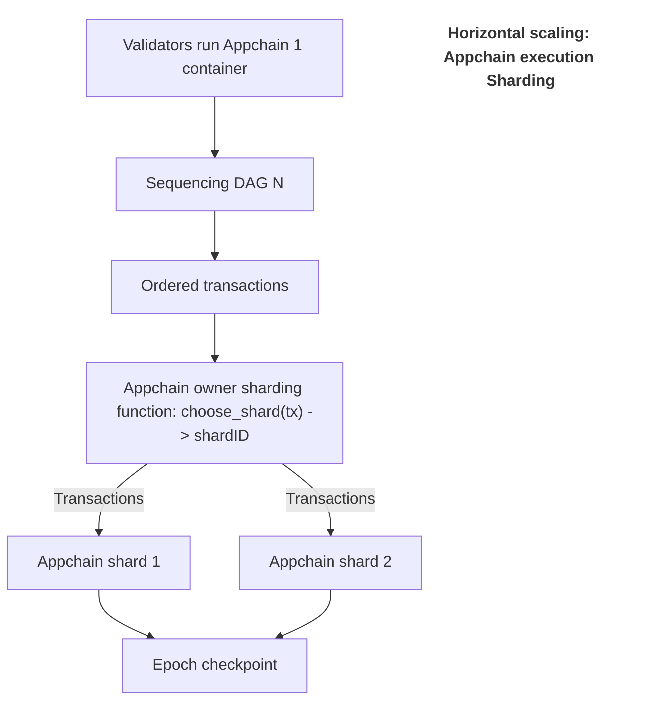

## Developing an Appchain with Pelagos

Launching an Appchain with Pelagos is as simple as deploying a smart contract. The developer can execute a single transaction providing the:

- Hash of a Docker container
- (Optional) genesis data
- Info-hash (for immutable database distribution)

and run each Appchain exactly as one runs one, or multiple, microservices.

Normally, using gRPC in a distributed system requires developers to define services in Protocol Buffers (Protobuf), handle client and server pairing and stub generation, HTTP/2 multiplexing, and deal with stream or unary message handling, serialization, and error management. With Pelagos, these gRPC setup steps are hidden behind simple callback hooks and event subscriptions, allowing developers to focus on business logic.

Pelagos abstracts away the complexities of gRPC communication between execution, state, and sequencing layers. From the perspective of a developer, it feels like working with a standard database rather than dealing with blocks or consensus directly, while providing access to:

- Blockchain data availability in Appchain smart contracts.
- Blockchain data finality guarantees.
- Creation, signing, and submission of transactions to target blockchains.
- Support for both GG20 and FROST(ROAST) protocols for TSS

This ensures a seamless, scalable, and secure multichain interaction model.

### Select the desired execution environment

Pelagos puts the choice of which virtual machines (VMs) to use for transaction processing in the hands of the developer. Developers can deploy any Docker container as the execution environment, enabling flexible and custom transaction handling.

It's even possible for developers to build heterogeneous Appchains by combining EVM, SVM, and Move execution environments across different shards within the same Appchain.

The VMs are supported with predicable data flows, for example:

- Deterministically ordered transactions and L1 blocks from the sequencing layer
- Transactions and blocks are processed in batches, allowing the developer to define custom block formation rules.

Furthermore, Pelagos embraces migrations and hard forks as a natural part of Appchain evolution and supports this with mechanisms designed to handle safe data migration and execution updates.

### Choose or extend the RPC

The RPC (Remote Procedure Call) layer provides an external interface for Appchain nodes. Pelagos supports flexibility in RPC options for Appchains. This allows developers to choose one of the standard RPCs (e.g., Ethereum, Cosmos, Solana, etc.), or to create a custom RPC, potentially extending existing implementations to suit specific requirements.

This ensures that Appchains can integrate seamlessly with existing ecosystems or implement
unique solutions tailored to their needs.

### Leverage Appchain interoperability

Appchains deployed over Pelagos enjoy direct, native-level access to other blockchains for data retrieval and transaction submission. The multichain layer in Pelagos works like a universal L1SLOAD for any chain.

Combined with integrated TSS signing protocols for supported chains (secured by restaking and DKG), Appchains can send external transactions to other protocols or Appchains as a natural extension of their execution environment.

By enabling easy interoperability, Pelagos lets Appchains reuse and enhance existing protocols rather than competing for liquidity and users.

### Scale an Appchain with Pelagos

Pelagos brings Web2 scalability practices directly to Appchains; employing the Erigon DB-inspired model For Appchain data storage. This model is optimized for blockchains with large or rapidly growing states, offering:

- Hot databases: Designed to handle real-time data writes with periodic conversion into immutable snapshots.
- Immutable databases: Read-only incremental state snapshots that represent historical blockchain states.

These immutable databases serve as a historical record of the blockchain {"of the blockchain" is the Appchain data (not really a blockchain more a DAG, or is a da layer of the supported blockchains??} offer several advantages:

- Snapshots can be shared with other nodes via BitTorrent-like protocols, enabling efficient data synchronization.
- Operators can verify and validate the integrity of immutable databases before downloading, ensuring tamper-proof data distribution.
- By adopting this model, Pelagos transitions from traditional sync protocols, which distribute blocks, transactions, and state pieces with proofs, to efficient, one-time event, large-database file downloads. This significantly improves scalability and operational efficiency by reducing the messaging load.

#### Horizontal scaling 

In Pelagos, each Appchain can decide when to scale horizontally by sharding. A single sequencing process will serve these shards, allowing the Appchain to grow and scale seamlessly.

Developers can request additional shards by prompting Pelagos to create new execution microservices and redirect transactions from sequencing into a custom sharding function. For example, `get_shard(tx)` -> `shard_id`.

This mechanism transparently scales the transaction load (TPS) by distributing it across multiple shards, see Figure 2. Furthermore, this approach extends service offerings for restaking operators who can offer additional rewards from shards. 

##### Figure 2. Horizontal scaling through sharding


It is the thesis of the Pelagos designers that this model will foster organic ecosystem growth by aligning incentives among Appchains, validators, and service providers. 

#### Vertical scaling

Vertical scaling is supported supported at the database layer, thanks to Erigon's efficent DAG database. The immutable, incremental database design ensures optimal data locality and minimizes read amplification by including fast-access and presence/absence indexes from the outset. As a result, this database is inherently optimized for syncing and scaling.

To further enhance efficiency, these databases are distributed via BitTorrent-like protocols, enabling computation-free synchronization. This effective combination of database design and synchronization strategies mirrors the success of Erigon,the primary archive node solution applied by Ethereum and Polygon due to its exceptional optimization and sync capabilities.

Furthermore, any Appchain can "subscribe" to dedicated sequencing should it outgrow the shared infrastructure and require dedicated, larger-scale infrastructure for improved performance. Each dedicated sequencing service runs its own DAG consensus. This provides maximum throughput &mdash; with independent epochs and checkpoint proofs to ensure auditability and data integrity.

> Review [the figure depicting horizontal and vertical scaling within Pelagos](./security-at-scale.md#-figure-1-horizontal-and-vertical-scaling-within-pelagos)

### Define block times with Pelagos

Developers can determine the size of the blocks produced by their Appchains according to their own rules, independent of complex consensus steps at execution time. Like Rollups, Pelagos lets you “slice” transaction sequences into arbitrarily sized blocks, but without imposing heavy computational demand. Block times can be reduced by the developer to as low as 10–50 ms due to the deterministic and independent nature of transaction sequencing flow and block slicing functions.

### Leverage trigger event logic

Using the reactive smart contract, developers can leverage the unified data environment offered by Pelagos as a multichain data availability layer for in-app logic by setting up trigger events. 

Consider the following code sample that listens for events on data collected on a supported external chain and triggers cross-chain transactions: 

```solidity
// SPDX-License-Identifier: Unlicense
pragma solidity ^0.8.0;

/// @title Example Pelagos Reactive Contract

bytes memory payload = abi.encodeWithSignature(
    "credit(address,uint256)",
    _event.to,
    _event.value
);
emit TelerixCommon.EthereumTransaction(1, targetAddress, payload);
```

The following sample is commented to detail the mechanism:

```
// SPDX-License-Identifier: Unlicense
pragma solidity ^0.8.0;

/// @title Example Pelagos Reactive Contract
/// @notice Listens to events on an external chain and triggers cross-chain transactions
contract HandleTransferEventContract {

    // Define a struct to mirror the Transfer event format from an external chain
    struct Transfer {
        address from;
        address to;
        uint256 value;
    }

    /// @notice This function is called automatically by Pelagos when the subscribed event is observed
    /// @param _event Contains decoded Transfer event data from the source chain
    function handleTransfer(Transfer calldata _event) public {
        // Trigger a cross-chain transaction using Pelagos' reactive infrastructure
        // chainID: 1 (could be Ethereum mainnet, for example)
        // msg.sender: the invoker (typically the Pelagos execution engine)
        // "0x01": placeholder for actual payload you'd construct based on _event
        emit TelerixCommon.EthereumTransaction(1, msg.sender, "0x01");

        // 🛠️ TODO: Insert your custom cross-chain logic here.
        // Use `_event.from`, `_event.to`, `_event.value` to determine logic.
        // You could trigger mints, burns, swaps, or messages on other blockchains.
    }

    /// @notice Constructor sets up the subscription to the external event
    constructor () {
        emit TelerixCommon.Subscribe(
            11155111, // ID of the source chain (e.g., Sepolia)
            0x007a005651dd6cD4831fF911F7A34fE75182D9ad, // Address of the external contract to watch
            "event Transfer(address indexed from, address indexed to, uint256 value)", // Event signature to listen for
            bytes4(keccak256("handleTransfer((address,address,uint256))")), // Method selector to call when event is observed
            false, // Don't include raw source transaction data
            0 // Use default finality
        );
    }
}

/// @notice Common interface used by Pelagos' reactive framework to route cross-chain events and transactions
library TelerixCommon {
    /// @notice Event to tell Pelagos to subscribe to an external event on a source chain
    event Subscribe(
        uint subscribeChainID,
        address subscribeContractAddress,
        string subscribeEventSignature,
        bytes4 methodSignature,
        bool useSourceChainTxData,
        uint32 additionalFinality
    );

    /// @notice Event that triggers an outbound transaction to another chain
    event EthereumTransaction(
        uint chainID,
        address to,
        bytes data
    );
}
```