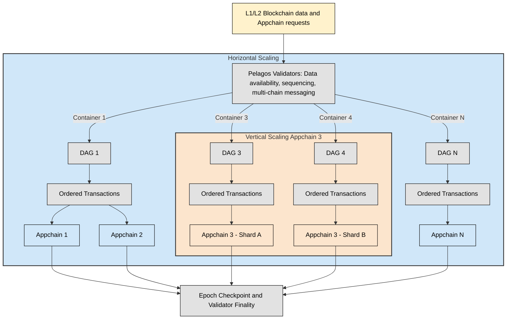

## Pelagos: Security at scale

The Pelagos protocol and its validator network are able to offer a scalable application logic layer that supports reactive smart contracts thanks to two principle architectural elements, a DAG consensus layer whose security is enforced through restaking.

### Security bootstrapping with restaking

Launching a new Appchain presents a well-known bootstrapping challenge: without an established validator set or strong stake base, the chain is vulnerable to centralization, security attacks, and validator coordination issues. This in turn makes it harder to attract new validators.

Pelagos inherits its security model from the underlying L1s. Restaking leverages capital already staked in large, established, and secure PoS (Proof of Stake) ecosystems (such as Ethereum, Bitcoin (via Babylon), Solana, TON, etc.). Validators can “restake” their locked assets to secure Pelagos Appchains, eliminating the need for each Appchain to bootstrap its own validator set or native token. 

Restaking is cornerstone to the Pelagos architecture ensuring that critical validation and execution duties are undertaken by entities whose alignment is ensured. By putting their existing stake at risk of slashing for poor performance or malicious behavior, validators are economically aligned with the success and security of the Appchains they serve. This allows new Appchains to gain immediate access to a large, robust, and decentralized validator network: avoiding the overhead of launching their own staking tokens, designing complex validator incentive models, or managing permissioned validator sets.

Pelagos’ approach increases system resilience by pooling validators across multiple chains and staking models. While restaking introduces shared risks—like slashing exposure cascading across chains—it also significantly raises the cost of attacking any single Appchain, since attackers must overcome the economic weight of the entire restaked network.

Pelagos security relies on robust tokens and substantial stakes rather than a single native token &mdash; removing the requirement to trust in a single chain’s token stability. By combining restaking from Ethereum, Bitcoin, Solana, and TON, Pelagos leverages an aggregate security stake far exceeding individual L1s.

Pelagos' Autonomous Verifiable Services (AVS) delegates tasks to restakers, such as:

- Sequencing consensus execution
- Performing TSS (Threshold Signature Scheme) for secure external transactions
- Multi-sig
- TEE (Trusted Execution Environment) validation
- Operating Appchain containers to ensure scalable and efficient execution
- Creating proofs and verification

> See more on the [validator role](./validating-appchain.md#validating-appchains-with-pelagos)

### Leaderless Directed Acyclic Graphs consensus

Pelagos presents a purpose-designed DAG consensus network, leveraging Erigon’s immutable database model to provide a multichain, universal state. 

Blockchains typically organize data as a linear chain of blocks, where each block contains multiple transactions and links cryptographically to the previous block, forming a single, sequential, immutable history. DAGs, by contrast, use a graph structure, allowing transactions to be processed independently and in parallel rather than sequentially. DAGs do not batch transactions into blocks but treat individual transactions as first-class entities that reference multiple prior transactions.

By substituting trusted third-party custodian or bridge operators with a decentralized collective validator set and a robust consensus protocol, Pelagos narrows trust assumptions to the distributed operator set, greatly reducing single points of failure and enhancing security.

DAG operators compose a distributed set of validators who observe events and transactions on external blockchains, reach consensus among themselves regarding these observations, and sequence them in the Pelagos DAG. These events then drive state changes in the relevant Appchains, which execute according to their business logic.

To achieve this, Pelagos integrates [Erigon's](https://erigon.tech/benefits-of-caplin-erigons-internal-cl-and-erigon-el-for-staking/) highly efficient database structure and modular client design delivering:

- Compact state management
- High throughput
- An optimized resource consumption model

Erigon ensures that the core universal state cannot be altered retroactively, protecting against rollback and censorship attacks. The DAG structure organizes and sequences events &mdash; such as transactions and state transitions &mdash; efficiently across all participating validators and Appchains, without forcing everything to pass through a single chain of blocks.

Erigon's immutable database model provides a multichain, universal state, ensuring efficient state synchronization. This enables Appchains to handle rapidly growing states across a multichain landscape without performance degradation.

Erigon's achieves this through its key attributes: 
-  Immutable state snapshots providing tamper-evident, incremental snapshots of blockchain states. 
> These snapshots enable seamless synchronization and verifiable data integrity across Appchains, reinforced by restaking confirmations through Pelagos checkpoints.
- Incremental database design enabling rapid synchronization by processing
only relevant components, making it highly adaptable for diverse Appchain architectures.
- Advanced historical indexing enabling users to define comprehensive historical indexes across Appchains and external blockchains. 
> This functionality supports enhanced tokenomics, reactive contracts, and rich, data-driven innovations.
- Graduality: Transaction-based graduality allos for efficient,
optimistic execution of EVM-like chains.
> Rolling back changes from a single transaction costs nearly nothing via Erigon.

#### Design considerations

The Pelagos DAG consensus was purpose‑built to meet a set of strict requirements for scalability, latency, security, and developer autonomy. This section explains the rationale behind its design choices and the trade‑offs involved.

#### Separation of sequencing and execution
Pelagos assigns its consensus layer a single responsibility: sequencing — agreeing on the order of transactions and events.  

Any invariant checks, state verification, or heavy computation occur in the execution layer at the Appchain level. This separation:

- Eliminates execution‑linked bottlenecks in consensus
- Keeps sequencing lightweight enough for near‑real‑time operation
- Allows Appchain developers to apply custom validation logic without impacting network‑wide throughput

##### Historical indexing as a native capability

A core capability of the Pelagos architecture is the efficient user historical index — a multi-source, developer-defined data layer available to every Appchain.

Historical indexes unify data from Appchains, external blockchains, or both, transforming static blockchain records into actionable intelligence. They underpin advanced smart contract functionality and data-driven tokenomics by making historical and real-time contract data queryable by default.

Traditionally, blockchains abstract away contract-level data, making it hard for UX developers to reuse it in new logic. Pelagos treats custom, multi-source indexes as first-class Appchain tooling.

Historical indexes leverage the superposition of immutable and real-time data for seamless state integration, facilitating:

- Data aggregation across sources allowing Appchains to ingest data from other Appchains or external blockchains

- Immutable “snapshots” for historical accuracy and “hot” storage for low-latency acces

- User-defined indexes: developers can define application-specific indexes, e.g., tracking user behavior, market flows, or cross-chain liquidity

- Fast and scalable queries: optimized for low-latency queries across highly fragmented chains

- Minimization of computational overhead optimizing for reactive contracts and dynamic tokenomics.

##### Why leaderless?

In leader‑based consensus models (e.g., Tendermint, Solana, Aptos), the leader can become the performance bottleneck, and targeted attacks on a leader can threaten liveness. Pelagos adopts a leaderless, Lachesis‑inspired DAG approach to:

- Avoid single points of failure
- Increase stability under validator churn or targeted disruption
- Let any validator initiate and process transactions, enhancing censorship resistance

##### Instant finality and low latency

The DAG achieves sequencing latency in the range of 150–250 ms, with deterministic, instant finality &mdash; crucial for reactive and cross‑chain contract logic.  

Contributing factors include:

- No block propagation; transactions are gossiped once during event creation
- Minimal signature verification per event
- Aggressive message pruning to lower network and storage overhead

##### Network throughput vs. CPU trade‑off

After optimising CPU and memory usage through Erigon’s database model, the main scaling limit shifts to **network bandwidth**. Pelagos’ consensus is engineered to:

- Reduce duplicate transaction broadcasts
- Optimise packet flow and message size
- Enable horizontal scaling when network input/output becomes a bottleneck

##### Horizontal scaling of sequencing

Because sequencing maintains no application state, it can be scaled out by adding more sequencing shards with minimal coordination overhead:

- Each shard is an independent service that can be started, merged, or reallocated without disrupting Appchains
- Storage per shard is minimal: a few gigabytes to support up to ~10,000 Appchains
- Shards can be provisioned to match Appchain growth, with validator revenues scaling via subscription fees rather than per‑transaction costs

#### Security model and decentralisation targets

Security of critical protocols like Distributed Key Generation (DKG) and Threshold Signature Schemes (TSS) requires a large, diverse validator set:

- Pelagos targets ~100+ restaking operators initially, scaling toward 500+ for long‑term resilience
- Censorship resistance is reinforced by accepting transaction ingress from multiple connected blockchains, not only direct submissions
- Participation in TSS/DKG is spread across the full validator set to avoid collusion risks

#### Comparison with other consensus designs

| Protocol / Design | Leader‑based? | Latency / Finality | CPU Usage | Network Dependency | Validator Set Size | Fault Tolerance at Scale |
|-------------------|--------------|-------------------|-----------|--------------------|--------------------|--------------------------|
| **Pelagos (Lachesis‑style)** | No | ~150–250 ms / instant | Higher | Lower | 100–500+ | Minimal degradation |
| Tendermint         | Yes | 1–2 s+ / deterministic | Medium | Medium | 100s | Leader bottleneck |
| Solana             | Yes (rotating) | 5–12 s / deterministic | Medium | High | 1000+ | Leader/relay bottleneck |
| Mysticeti          | Multi‑slot leader | ~1–3 s / deterministic | Low | High | Smaller sets | Faster degradation |
| Bullshark/Tusk     | Yes | 2–3 s / deterministic | Medium | Medium | Small (~30) | Limited scalability |

Pelagos’ choice reflects the need for a leaderless, sequencing‑only DAG that prioritises **network efficiency, stability under fault, and easy horizontal scaling** over minimising CPU load.

Pelagos’ decision to implement leaderless DAG sequencing enables a range of advanced use cases — from optimizing token inflation and rewards based on historical usage trends, to tracking cross‑chain liquidity flows and arbitrage opportunities, to enriching smart contracts with both historical and real‑time data for governance, staking, or automated market making. Its instant finality, near‑real‑time sequencing (~150–250 ms), and multi‑source transaction ingress keep historical indexes complete, up‑to‑date, and censorship‑resistant.

#### Built for scale

The Pelagos DAG is designed to support a growing number of users, transactions, peak loads, and an expanding state enabling the platform to scale. The DAG database structure is central Pelagos' ability to support the seamless, parallel operation of many Appchains as the platform grows.

Both state and historical data are stored in Erigon’s highly optimized, incrementally updated, immutable databases. These are synchronized across validators via gossip protocols that support rapid read/write capabilities and seamless, verifiable state sync.

Both the core platform and individual Appchains can be sharded for scalability. Sequencing and execution can be split across multiple microservices, allowing the platform to scale to thousands of Appchains and up to 100,000+ TPS as needed.

Individual Appchains can also scale independently; both horizontally and vertically. This scaling is fully controlled by the user and can be adjusted as the Appchain evolves.

#### Appchain sequencing and parallel scaling

Transactions and external block confirmations are sequenced with minimal latency and high throughput via the Lachesis-inspired DAG consensus. This enables fast finality and reliable ordering across all connected chains. 

By implementing a highly flexible approach to sequencing transactions and events across Appchains, Pelagos supports both parallelism and resilience at scale. 

Rather than forcing all traffic through a single sequencer, Pelagos applies a many-to-many (N:M) model: facilitating multiple independent sequencing processes. Each is represented by its own DAG consensus allowing the platform to serve a growing number of Appchains, all coordinated by a unified validator set.

This modular sequencing design ensures that high transaction volumes or temporary congestion on one Appchain do not adversely affect others. Each Appchain proceeds through its own consensus cycles independently, with all chains synchronized to complete an epoch at the same universal median time. 

> For example, if Appchain epochs are set to end every day at 00:00, all Appchains finalize their state at precisely that moment, coordinated via consensus across validators. At each epoch's close, a checkpoint is created,a cryptographic snapshot of state, the validators collectively sign this checkpoint using threshold signature schemes (TSS), ensuring shared trust and immutability of state transitions.

As network demand shifts and certain Appchains start to require more sequencing resources, Pelagos offers seamless vertical scaling. If an Appchain begins to consume disproportionate amounts of bandwidth or computation, it can be migrated, without data loss or break in continuity, to its own dedicated sequencing DAG. This migration is elegantly handled at the epoch boundary: after the Appchain’s checkpoint is committed. The Appchain is then shifted out of the shared sequencer onto a standalone path, with its state and event history preserved.

##### Figure 1. Horizontal and vertical scaling within Pelagos

These features ensure Pelagos scales horizontally by parallelizing sequencing across many DAGs, and vertically, by promoting individual Appchains into powerful standalone flows whenever necessary. This many-to-many sequencing model underpins both day-one performance and long-term flexibility for every user and developer on the Pelagos platform.

> See more on [horizontal and vertical scaling with Pelagos](./developing-appchain.md#scale-an-appchain-with-pelagos).

